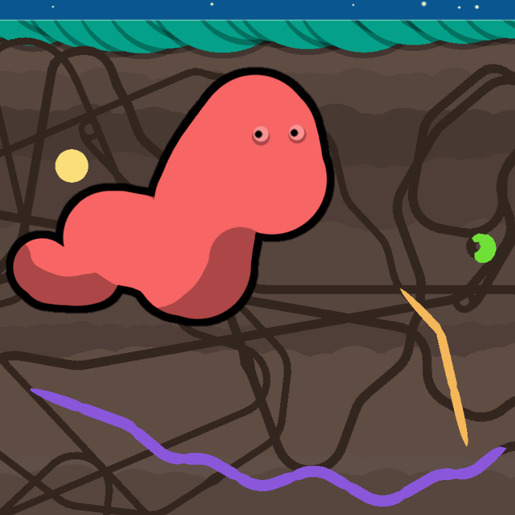

# GilistAir
360 degree worm game. Made for an early AirConsole contest

# Original description
360 degree worm game. Eat food, trap the others, grow the longest earthworm! Your smartphone is the gamepad, your browser is the console.

# Files
The screen.html is the main game while the controller.html is the controller screen shows up on mobile phones when connected via AirConsole with the main game.

Index.html is a standalone version to test the game with 3 keyboard controlled players added.

# How to control the players in the index.html
- Player 'Bendegúz': left/right arrow keys
- Player 'Boldi' : A/S
- Player 'Dani' : H/J

# Features
- Eat food to grow
- Died worms turn white becoming obstacle for a while
- Eat the Triforce to become invicible and clean dead worms
- Split a worm or myself in half when invicible - controlling two worms at the same time
